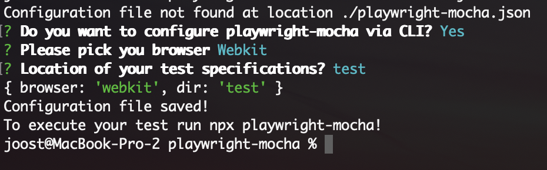

# playwright-mocha

<!-- badges: start -->
[](https://npmjs.org/package/playwright-mocha)
<!-- badges: end -->

The aim of playwright-mocha is to deliver a lightweight test-framework that is combining the power of [mocha](https://mochajs.org/) and [playwright](https://playwright.dev/). You should be able to use all configuration options you can provide via mocha or playwright. If you miss something raise an issue or open a pull request.


## Installation and configuration via CLI

<br>

To install the framework:

`npm install playwright-mocha`

<br>

To run:

`npx playwright-mocha`

If no configuration file is found the CLI is automatically activated to setup the file via the CLI.



## Create test 

Example

```javascript
const assert = require('assert');
const { PlaywrightMocha } = require('playwright-mocha/dist/pm');

it('checks the title of the page', async () => {

  const page = PlaywrightMocha.page();

  await page.goto('https://www.headlesstesting.com/');
  const title = await page.title();
  assert.strictEqual(title, 'Headless Testing with Puppeteer and Playwright in the Cloud.');
})
```

## Advanced configuration

The only thing you need now is a configuration file the paramaters browser and testFilesBaseDir are custom framework paramaters the rest of the paramaters are 1:1 mapped to specific playwright or mocha options.

| Name      | options |
| ----------- | ----------- |
| browser      | firefox/chromium/webkit       |
| testFilesBaseDir | relative path to your folder containing the test files |
| playwrightLaunchOptions   | https://playwright.dev/docs/api/class-browsertype?_highlight=launch#browsertypelaunchoptions        |
| playwrightContextOptions | https://playwright.dev/docs/api/class-browser?_highlight=context&_highlight=op#browsernewcontextoptions |
| mochaOptions | https://mochajs.org/api/mocha |

<br>
 
## Parallel execution

The framework supports parallel execution for each test/spec file. 
To enable this feature you can add the following lines to the "mochaOptions" in the configuration file.

```json
    "require": ["node_modules/playwright-mocha/dist/hooks.js"],
    "parallel": true
```


### example config with parallel execution
```json 
{
  "browser": "firefox",
  "testFilesBaseDir": "examples",
  "playwrightLaunchOptions": {
    "headless": false
  },
  "playwrightContextOptions": {

    "viewport": {
      "width": 1600,
      "height": 1000
    },
    "recordVideo": {
      "dir": "video"
    }
  },
  "mochaOptions": {
    "timeout": 30000,
    "require": ["node_modules/playwright-mocha/dist/hooks.js"],
    "parallel": true
  }
}
```
